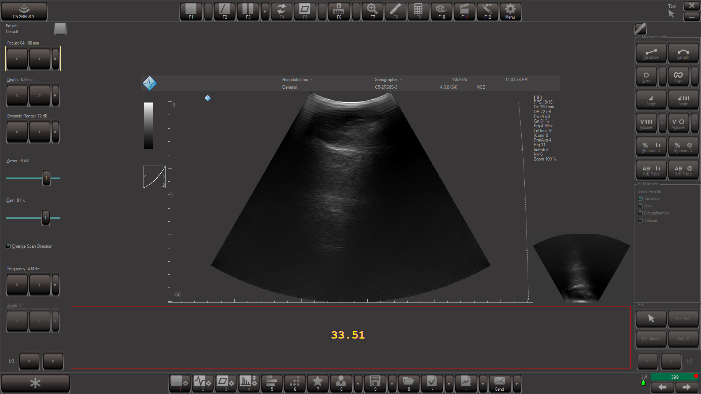

# Overlay Example

This repository provides a simple Python example demonstrating how to capture screenshots and draw a basic overlay window on the screen using Tkinter.



## Requirements

1.  **Python Packages:** Install the necessary libraries using pip and the provided requirements file:
    ```bash
    pip install -r requirements.txt
    ```

2.  **Tk/Tcl:** The script uses Tkinter, which depends on an underlying Tk/Tcl installation.
    * This is usually **included** with standard Python installations on Windows and macOS.
    * On many Linux distributions, you may need to install it separately using your package manager (e.g., `sudo apt install python3-tk` on Debian/Ubuntu systems).
    * For detailed, platform-specific instructions, refer to the [Tk installation documentation](https://tkdocs.com/tutorial/install.html).
